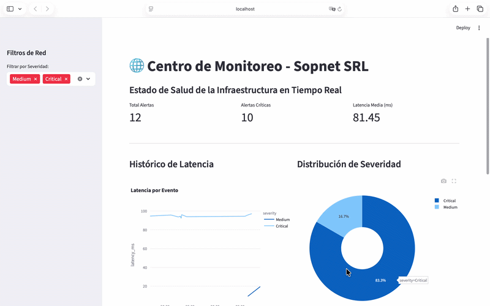

cat << 'EOF' > README.md
# 🌐 ISP Network Anomaly Detection & Observability Suite

Este ecosistema de software está diseñado para transformar métricas crudas de infraestructura de red en **decisiones operativas proactivas**. Desarrollado pensando en los desafíos de escalabilidad y estabilidad de un **ISP (Internet Service Provider)**.

### 🎥 Demo en Vivo

---

## 🚀 Propuesta de Valor
A diferencia de los sistemas de monitoreo tradicionales basados en umbrales fijos (Hard-thresholds), este sistema utiliza **Machine Learning No Supervisado** para identificar degradaciones de servicio sutiles que suelen pasar desapercibidas, reduciendo el tiempo de respuesta ante incidentes (MTTR).

## 🏗️ Arquitectura del Sistema
El proyecto sigue un patrón de diseño desacoplado para asegurar la mantenibilidad:

1. **Ingestion Engine:** Genera y procesa vectores de red (Bandwidth, Latency, Packet Loss).
2. **ML Inference Layer:** Utiliza **Isolation Forest** (Scikit-learn) para detectar anomalías multidimensionales.
3. **Persistence Layer:** Almacenamiento relacional en **SQLite** para trazabilidad histórica.
4. **Presentation Layer:** Dashboard interactivo en **Streamlit** con KPIs en tiempo real.

---

## 🛠️ Stack Tecnológico
* **Core:** Python 3.14
* **IA/ML:** Scikit-learn, Pandas, NumPy
* **Data Vis:** Plotly Express, Streamlit
* **Storage:** SQLite3

## ⚙️ Instalación y Quick Start
1. **Clonar el repositorio:**
   \`\`\`bash
   git clone https://github.com/maximoPasturensi/network-anomaly-detection.git
   cd network-anomaly-detection
   \`\`\`
2. **Instalar dependencias:**
   \`\`\`bash
   pip install -r requirements.txt
   \`\`\`
3. **Generar datos e inferencia:**
   \`\`\`bash
   python3 main.py
   \`\`\`
4. **Lanzar el Centro de Monitoreo:**
   \`\`\`bash
   streamlit run dashboard.py
   \`\`\`

---

## 📩 Contacto
**Máximo Pasturensi** - Analista Programador | Data Engineering Student
[LinkedIn](https://www.linkedin.com/in/maximo-pasturensi-806820333/) | [GitHub](https://github.com/maximoPasturensi)
EOF